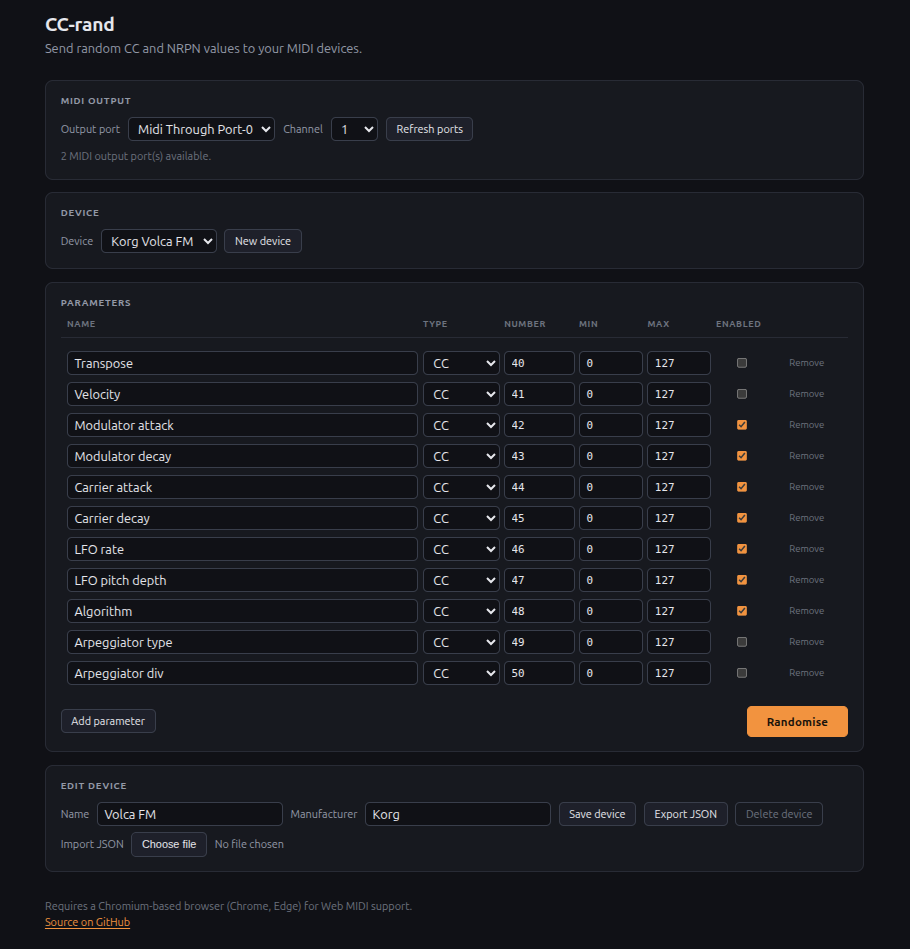

# MIDI Randomiser

A small web application for sending random CC and NRPN values to MIDI devices.

Live at <https://llozd.github.io/midi-randomiser/>

You define "devices" - named sets of MIDI parameters (CC or NRPN, each with a
number and a value range) - pick a MIDI output and channel, and hit **Randomise**
to send a fresh random value to every enabled parameter.



## Requirements

- A Chromium-based browser (Chrome, Edge, Brave). MIDI output uses the Web MIDI
  API, which is not available in Firefox or Safari.
- The browser asks permission the first time the page requests MIDI access. The
  app can't list output ports until it is granted.

## Running locally

The app is plain static files with no build step. Serve the folder over HTTP and
open it in Chrome/Edge:

```bash
npx serve
# or
python3 -m http.server
```

## Development

Dev tooling (linters) is managed with npm. It is only needed for contributing -
running the app itself needs no install.

```bash
npm install    # installs linters and sets up the pre-commit hook
npm run lint   # eslint + stylelint + json format + html + device files
npm run manifest   # rebuild devices/index.json after adding a device
```

Linting runs in CI on every pull request and must pass before merge.

## Adding a device

Devices are plain JSON files in `devices/`. See [CONTRIBUTING.md](CONTRIBUTING.md).
